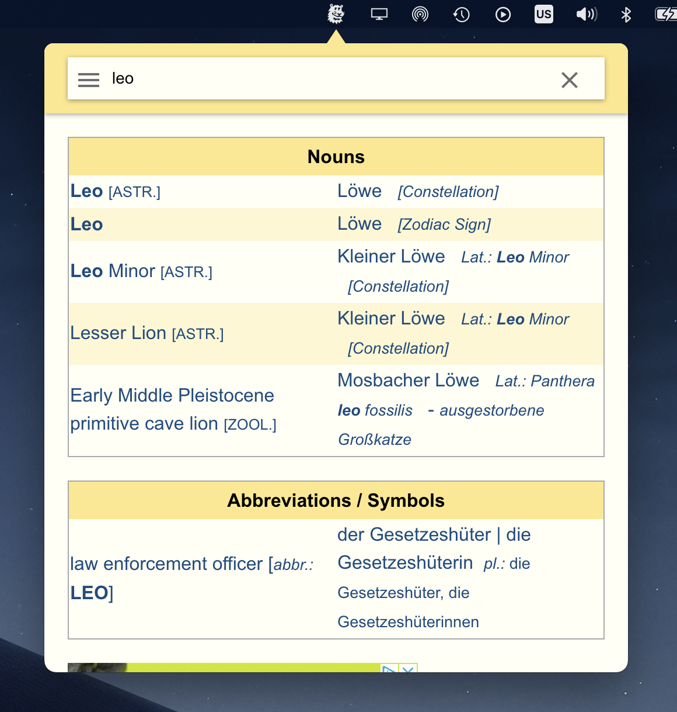

<h1 align="center"></h1>
<h1 align="center">Leo.org Menu Bar Client</h1>
<p align="center">Free and simple app that integrates <a href="https://www.leo.org/">Leo.org</a> dictionary into your menu bar.</p>
<p align="center">
    <a href="https://github.com/vvvar/leo-bar/releases/latest"><b>Download</b></a> •
    <a href="https://github.com/vvvar/leo-bar/issues"><b>Open Issue</b></a>
</p>



## Supported Platforms

- macOS 
    - Both Intel and Apple Silicon are supported.
    - Tested with macOS 12 Monterey.
    - macOS Ventura support is not yet confirmed.
- Windows
    - Tested with Windows 10
    - Windows 11 support is not yet confirmed.
- Linux
    - Tested with Ubuntu 22.04 LTS.

## How to Install

1. Go to <a href="https://github.com/vvvar/leo-bar/releases/latest"><b>latest release</b></a> page.
2. In the Assets section choose installer for your platform.

#### macOS

Install app via **.dmg** file.
For macs that are using **Apple Silicon** processor - choose one that ends with **arm64.dmg**.
For macs that are using **Intel** processor - choose one that ends with **x64.dmg**

> **Note**
> App do not adds itself as a login item. If you want it to launch automatically on boot - follow [this guide](https://support.apple.com/en-gb/guide/mac-help/mh15189/mac).

#### Windows

Install app via **.exe** file.
Just run it and wait untill installation completed. Once installed you'll find the app in your tray.

> **Note**
> App do not adds itself as a startup app. If you want it to launch automatically on boot - follow [this guide](https://support.microsoft.com/en-gb/windows/change-which-apps-run-automatically-at-startup-in-windows-9115d841-735e-488d-e749-9ba301d441e6#ID0EBD=Windows_10).

#### Linux

App provided as a **.deb** package.
To install, use following command as a reference:
```sh
sudo apt install /path/to/package/name.deb
```

## License

This app is licensed under the GNU General Public License v3.0 (GPL-3).

## Credits

- [Leo.org](https://www.leo.org/) - a multilingual online dictionary provided by Leo GmbH.
- [ElectronJS](https://www.electronjs.org) - framework for building cross-platform desktop apps with JavaScript, HTML, and CSS.
- [Electron Forge](https://www.electronforge.io) - all-in-one tool for packaging and distributing Electron applications.
- [ChatGPT for desktop](https://github.com/vincelwt/chatgpt-mac) - menu-bar client for ChatGPT. Took it as a reference of menu bar app.
